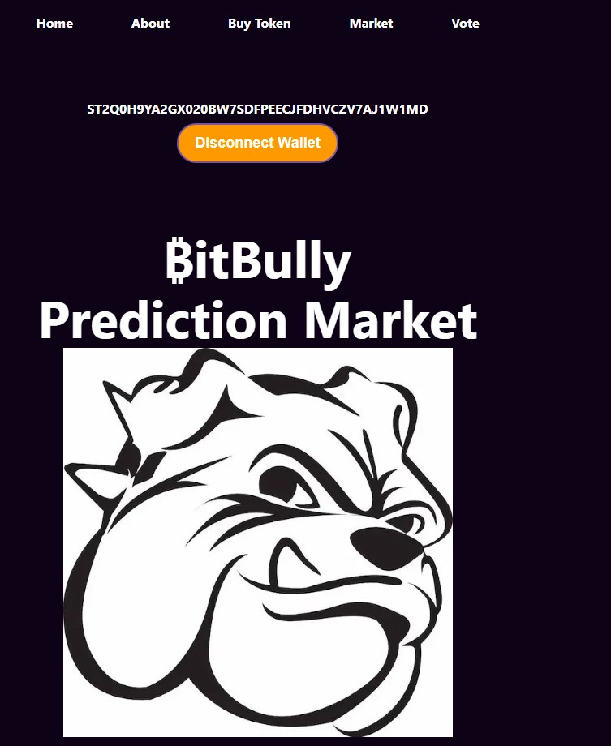
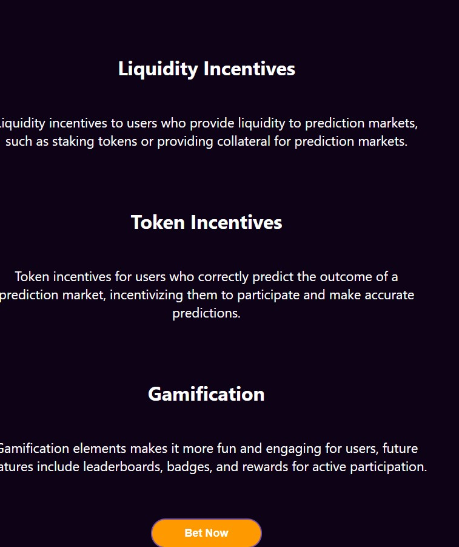
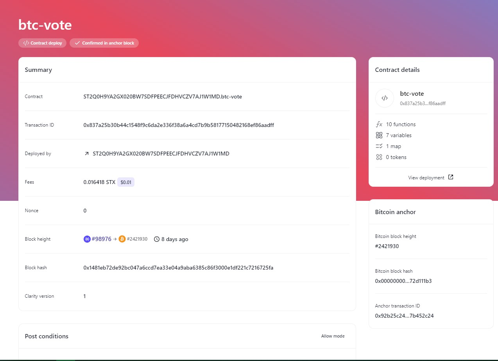
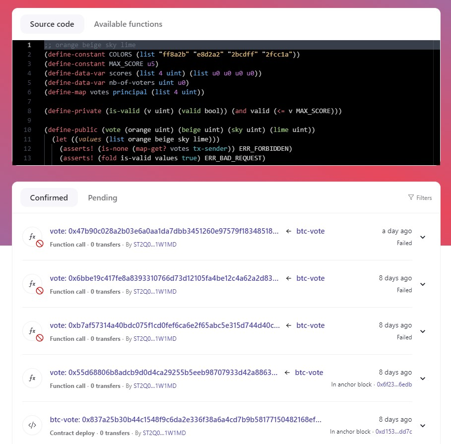

# BitBully Prediction Market
## Built on Stacks

*Step into the world of high-stakes predictions and exhilarating trades with BitBully, the Bitcoin prediction market that lets you bet on the future utilizing the world's most popular cryptocurrency.*

**Decentralized Markets:**
Decentralized oracle network will provide accurate and reliable data for resolving prediction markets.

**User-Customized Markets:**
Users can create and customize their own prediction markets based on any topic or event, incentivizing them to create and participate in more prediction markets.

**Liquidity Incentives:**
Liquidity incentives to users who provide liquidity to prediction markets, such as staking tokens or providing collateral for prediction markets.

**Token Incentives:**
Token incentives for users who correctly predict the outcome of a prediction market, incentivizing them to participate and make accurate predictions.

**Gamification:**
Gamification elements makes it more fun and engaging for users, future features include leaderboards, badges, and rewards for active participation.

## How to start the Clarity project

> npm install

> cd frontend

> npm install

> npm start

## Screens

